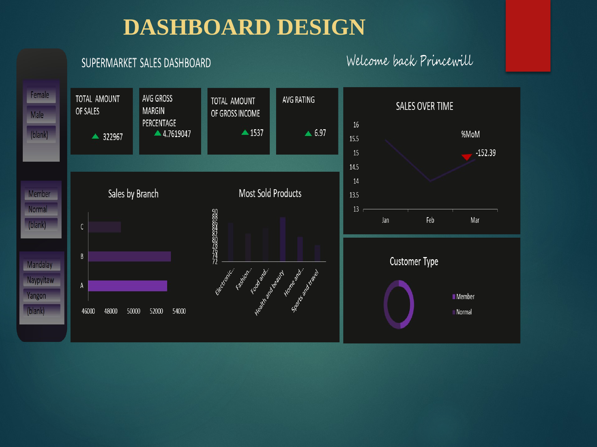

# Supermarket Sales Analysis

## Project Overview

This project analyzes supermarket sales data to identify sales trends, product performance, customer behavior, and payment patterns.

The analysis was carried out as part of my Data Analyst internship using Microsoft Excel. The project demonstrates practical skills in data cleaning, exploratory analysis, data visualization, dashboard development, and communicating actionable insights.

## Objectives

- Analyze sales performance across different branches.
- Identify the best-performing product lines.
- Examine sales trends across different periods.
- Analyze customer types and payment methods.
- Create visualizations and a dashboard to communicate findings.

## Dataset

The dataset was obtained from Kaggle and contains more than 1,000 supermarket sales transactions.

Key fields include:

- Branch
- Product Line
- Payment
- Date
- Total Sales
- Customer Type

## Tools Used

- Microsoft Excel
- Pivot Tables
- Excel Charts
- Excel Dashboard
- Data Cleaning and Transformation

## Methodology

1. Imported the supermarket sales dataset into Microsoft Excel.
2. Inspected the dataset for formatting issues and duplicate records.
3. Cleaned and organized the data for analysis.
4. Used Pivot Tables to summarize sales across branches, product lines, customer types, and payment methods.
5. Created charts to visualize important trends and comparisons.
6. Developed an interactive dashboard to present the major findings.
7. Interpreted the results to identify useful business insights.

## Key Findings

- Branch B recorded the highest overall sales performance.
- Food and Beverages was the highest-performing product line.
- Sales were generally higher on weekends.
- Cash was the most commonly used payment method.
- Members recorded slightly higher spending than normal customers.

## Project Outcome

The analysis demonstrates how structured data analysis and visualization can be used to identify sales trends, monitor product performance, understand customer behavior, and support data-driven business decisions.

## Author

**Ben Princewill Pius**

Aspiring Data Analyst | Python | Power BI | Excel | Data Visualization
